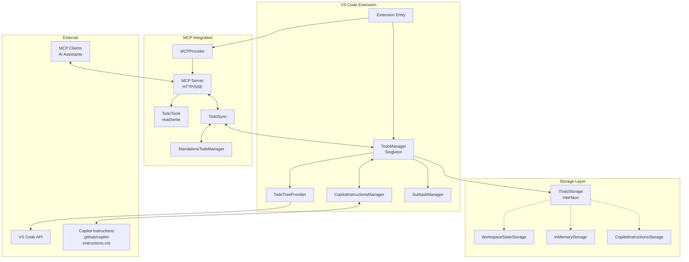

This is a VS Code extension project. Please use the get_vscode_api with a query as input to fetch the latest VS Code API references.

!Important:
- Keep this document up-to-date with the latest architecture and coding standards.
- NEVER proactively create documentation files (*.md) or README files. Only create documentation files if explicitly requested by the User.


## Project Overview

This extension provides AI assistants with todo management tools through MCP (Model Context Protocol) and an integrated VS Code tree view. It enables AI assistants to proactively track tasks during development workflows with support for subtasks, priorities, and auto-injection into Copilot instructions.

For more details:
- [Main README](../README.md) - Feature overview and usage
- [MCP Server Documentation](../src/mcp/README.md) - Server architecture and protocol details
- [VS Code Extension API](https://code.visualstudio.com/api/extension-guides/tools) - Language model tools guide

## Architecture



## Coding Standards

### TypeScript Patterns

- Use strict TypeScript with proper type definitions
- Implement singleton pattern for `TodoManager` (see `src/todoManager.ts`)
- Follow VS Code extension conventions with proper disposable cleanup
- Use event emitters for reactive state management

### VS Code API Usage

- Always use `vscode.lm.registerTool()` for language model tools (see https://code.visualstudio.com/api/extension-guides/tools)
- Implement `vscode.TreeDataProvider<T>` for tree views
- Use `vscode.ThemeIcon` for consistent iconography
- Follow activation event patterns: `onLanguageModelTool:tool_name`

### File Organization

```
src/
├── extension.ts                # Main activation/deactivation
├── todoManager.ts              # Singleton state management
├── todoTreeProvider.ts         # Tree view implementation
├── subtaskManager.ts           # Subtask handling
├── copilotInstructionsManager.ts # Auto-inject sync
├── todoValidator.ts            # Input validation
├── types.ts                    # Shared interfaces
├── storage/
│   ├── ITodoStorage.ts         # Storage interface
│   ├── WorkspaceStateStorage.ts # Default VS Code storage
│   ├── InMemoryStorage.ts      # Memory-based storage
│   └── CopilotInstructionsStorage.ts # File-based storage
└── mcp/
    ├── mcpProvider.ts          # VS Code MCP integration
    ├── server.ts               # HTTP/SSE server
    ├── standalone.ts           # Standalone entry point
    ├── todoSync.ts             # Bidirectional sync
    └── tools/
        └── todoTools.ts        # MCP tool implementations
```

## Required Patterns

### MCP Tool Registration

```typescript
// MCP tools are registered through the MCP server
export const todoReadTool = {
  name: "todo_read",
  description: "Read the current todo list",
  inputSchema: {
    type: "object",
    properties: {},
    required: []
  }
};

// Dynamic tool registration based on configuration
if (!config.autoInject) {
  server.setRequestHandler(ListToolsRequestSchema, async () => ({
    tools: [todoReadTool, todoWriteTool]
  }));
}
```

### Storage Pattern

All storage implementations follow [`ITodoStorage`](../src/storage/ITodoStorage.ts) interface:

```typescript
// Example usage with any storage implementation
const storage: ITodoStorage = new WorkspaceStateStorage(context);
await storage.save(todos, title);
const { todos, title } = await storage.load();
```

Available implementations:
- [`WorkspaceStateStorage`](../src/storage/WorkspaceStateStorage.ts) - VS Code workspace state
- [`InMemoryStorage`](../src/storage/InMemoryStorage.ts) - Temporary in-memory storage
- [`CopilotInstructionsStorage`](../src/storage/CopilotInstructionsStorage.ts) - File-based storage

### Language Model Tools

```typescript
// Use this pattern for tool registration
const tool = vscode.lm.registerTool("tool_name", new ToolClass());
context.subscriptions.push(tool);

// Tool implementation must extend LanguageModelTool<T>
class TodoReadTool implements vscode.LanguageModelTool<{}> {
  async invoke(options: vscode.LanguageModelToolInvocationOptions<{}>) {
    return new vscode.LanguageModelToolResult([
      new vscode.LanguageModelTextPart(JSON.stringify(data)),
    ]);
  }
}
```

### Tree View Pattern

```typescript
// Always implement both TreeDataProvider and TreeItem
export class TodoTreeDataProvider
  implements vscode.TreeDataProvider<TodoTreeItem>
{
  private _onDidChangeTreeData = new vscode.EventEmitter<
    TodoTreeItem | undefined | null | void
  >();
  readonly onDidChangeTreeData = this._onDidChangeTreeData.event;

  getTreeItem(element: TodoTreeItem): vscode.TreeItem {
    return element;
  }
  getChildren(element?: TodoTreeItem): Thenable<TodoTreeItem[]> {
    /* implementation */
  }
}
```

### Package.json Contributions

See [`package.json`](../package.json) for full configuration:

- **MCP Server Definition Providers**: Register with `mcpServerDefinitionProviders`
- **Views**: Specify in `explorer` container with `id`, `name`, `icon`
- **Commands**: Define with `command`, `title`, `icon` fields
- **Configuration**: Settings under `todoManager.*` namespace

## Data Models

See [`src/types.ts`](../src/types.ts) for complete type definitions:
- `TodoItem` - Main todo structure with status, priority, subtasks, and details
- `Subtask` - Nested task structure
- `TodoWriteInput` - Input schema for todo_write tool

## Error Handling

- Validate all language model tool inputs before processing
- Return descriptive error messages via `LanguageModelTextPart`
- Use try/catch blocks around VS Code API calls
- Dispose of resources properly in `deactivate()`

## Security Notes

- Never store sensitive data in todo items
- Validate input schemas strictly in language model tools
- Use VS Code's built-in confirmation dialogs for destructive actions

## Testing Strategy

- Test extension activation/deactivation lifecycle
- Verify MCP server and tool operations
- Test tree view data updates and refresh behavior
- Validate todo state persistence across sessions
- Storage implementation compliance with ITodoStorage
- End-to-end MCP integration tests

See test files in [`src/test/`](../src/test/) for examples.
