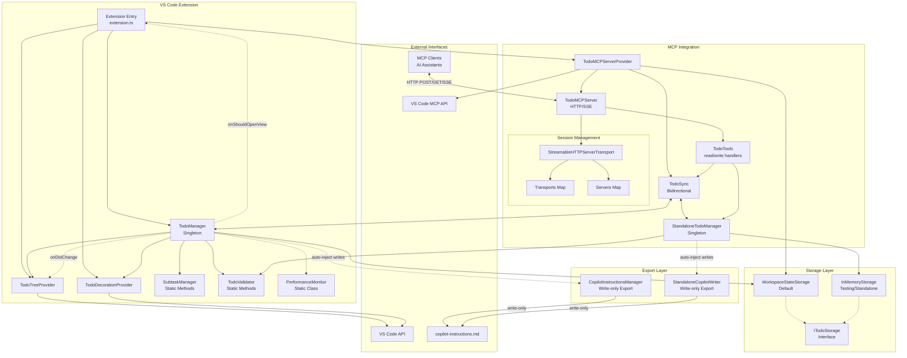

This is a VS Code extension project. Please use the get_vscode_api with a query as input to fetch the latest VS Code API references.

IMPORTANT:

- ALWAYS plan changes using detailed todos
- ALWAYS keep `.github/copilot-instructions.md` up-to-date with the latest architecture and coding standards, addressing any drifts in implementation!
- ALWAYS validate changes by running compile and test commands!
- NEVER proactively create documentation files (\*.md) or README files. Only create documentation files if explicitly requested by the User.
- NEVER make changes backwards compatible unless explicitly requested by the User.
- NEVER create one-off scripts to test changes.

## Project Overview

This extension provides VS Code agent mode with todo management tools through MCP (Model Context Protocol) and an integrated VS Code tree view. It enables AI assistants to proactively track tasks during development workflows with support for subtasks, priorities, and auto-injection into Copilot instructions.

For more details:

- [Main README](../README.md) - Feature overview and usage
- [MCP Server Documentation](../src/mcp/README.md) - Server architecture and protocol details
- [MCP TypeScript SDK](https://github.com/modelcontextprotocol/typescript-sdk/)

## Architecture



## Performance Optimizations

### Event System Architecture

The extension uses a **consolidated event pattern** to prevent performance issues:

```typescript
// CORRECT: Single consolidated event
todoManager.onDidChange((change) => {
  // Handle both todo and title changes
  updateTreeView(change.todos);
  updateTitle(change.title);
});

// WRONG: Never use separate events (causes cascade loops)
// todoManager.onDidChangeTodos(...) // DO NOT USE
// todoManager.onDidChangeTitle(...) // DO NOT USE
```

**Key Requirements:**

- Always use the single `onDidChange` event that provides both todos and title
- Never create or use separate events for different properties
- All managers (TodoManager, StandaloneTodoManager) must implement the same event interface

### Change Deduplication

All state changes use enhanced hash-based deduplication with version tracking to handle edge cases:

```typescript
private fireConsolidatedChange(): void {
  const isEmptyTransition = // ... detect empty transitions
  const currentHash = JSON.stringify({
    todos: this.todos,
    title: this.title,
    version: isEmptyTransition ? ++this.updateVersion : this.updateVersion
  });
  if (currentHash !== this.lastUpdateHash || isEmptyTransition) {
    this.lastUpdateHash = currentHash;
    this.onDidChangeEmitter.fire({ todos: this.todos, title: this.getTitle() });
  }
}
```

**Key Features:**

- Version field increments on empty transitions to force updates
- Empty transitions (0→n or n→0 todos) always trigger immediate updates
- Prevents deduplication from blocking critical UI updates

### Debouncing Strategy

Components use optimized debounce timings with special handling for empty transitions:

- **Tree View Updates**: 50ms debounce (immediate for empty transitions)
- **File Operations**: 500ms debounce to batch rapid changes
- **MCP Sync**: 0ms for empty transitions, 10ms otherwise

### TodoSync Improvements

The bidirectional sync mechanism includes:

```typescript
// Promise-based synchronization to handle concurrent updates
private syncPromise: Promise<void> | null = null;

// Proper race condition handling
if (this.syncPromise) {
  await this.syncPromise; // Wait for in-progress sync
}
```

**Key Features:**

- Promise-based sync queue prevents race conditions
- Version tracking ensures sync order consistency
- Comprehensive logging for debugging sync issues
- Empty transition detection forces immediate sync

### Async Initialization

MCP server initialization is non-blocking to prevent extension startup delays:

```typescript
// Initialize MCP server asynchronously
setImmediate(async () => {
  await mcpProvider.ensureServerStarted();
});
```

### File Operation Queueing

File writes are queued to prevent concurrent access issues:

```typescript
private async writeWithQueue(todos: TodoItem[], title?: string): Promise<void> {
  if (this.writeInProgress) {
    this.pendingWrite = { todos, title };
    return;
  }

  this.writeInProgress = true;
  try {
    await this.performWrite(todos, title);

    // Process any pending write
    if (this.pendingWrite) {
      const pending = this.pendingWrite;
      this.pendingWrite = null;
      await this.writeWithQueue(pending.todos, pending.title);
    }
  } finally {
    this.writeInProgress = false;
  }
}
```

## Critical Implementation Patterns

**ALWAYS follow these patterns to avoid sync issues:**

1. **Single Consolidated Event Pattern** - Never create separate events for different properties
2. **Empty State Transitions** - Always force sync when todo count changes between 0 and n
3. **Promise-Based Sync** - Use promise queuing to prevent race conditions
4. **Hash-Based Deduplication** - Include version tracking for forced updates
5. **Proper Test Context** - Initialize with mock storage to avoid "context not initialized" errors

## Coding Standards

### TypeScript Patterns

- Use strict TypeScript with proper type definitions
- Implement singleton pattern for `TodoManager` (see `src/todoManager.ts`)
- Follow VS Code extension conventions with proper disposable cleanup
- Use consolidated event pattern for state management (never separate events)

### VS Code API Usage

- Use `vscode.lm.registerMcpServerDefinitionProvider()` for MCP server integration
- Implement `vscode.TreeDataProvider<T>` for tree views
- Register `vscode.FileDecorationProvider` for todo item styling
- Use `vscode.ThemeIcon` for consistent iconography
- Handle tree view badges with `TreeView.badge` for task counts
- Move toggle actions to overflow menus using grouped menu items without `navigation` group
- Use conditional menu items with different titles/icons to show toggle states (checkbox-style)
- Use `workbench.action.chat.open` with agent mode to integrate with VS Code's chat functionality
- Set context keys with `vscode.commands.executeCommand('setContext', key, value)` for conditional UI visibility
  - `agentTodos.hasTodos` - Set to true when todo list has items, false when empty (controls clear button visibility)

### File Organization

```
src/
├── extension.ts                # Main activation/deactivation
├── todoManager.ts              # Singleton state management
├── todoTreeProvider.ts         # Tree view implementation
├── subtaskManager.ts           # Subtask handling
├── copilotInstructionsManager.ts # Auto-inject sync
├── todoValidator.ts            # Input validation
├── types.ts                    # Shared interfaces
├── storage/
│   ├── ITodoStorage.ts         # Storage interface
│   ├── WorkspaceStateStorage.ts # Default VS Code storage
│   └── InMemoryStorage.ts      # Memory-based storage
├── utils/
│   └── performance.ts          # Performance monitoring utility
└── mcp/
    ├── mcpProvider.ts          # VS Code MCP integration
    ├── server.ts               # HTTP/SSE server
    ├── standalone.ts           # Standalone entry point
    ├── standaloneTodoManager.ts # Standalone manager singleton
    ├── todoSync.ts             # Bidirectional sync
    ├── types.ts                # MCP-specific types
    ├── standaloneCopilotWriter.ts # Standalone markdown writer
    └── tools/
        └── todoTools.ts        # MCP tool implementations
```

## Required Patterns

### Storage Pattern

All storage implementations follow [`ITodoStorage`](../src/storage/ITodoStorage.ts) interface:

```typescript
// Example usage with any storage implementation
const storage: ITodoStorage = new WorkspaceStateStorage(context);
await storage.save(todos, title);
const { todos, title } = await storage.load();
```

Available implementations:

- [`WorkspaceStateStorage`](../src/storage/WorkspaceStateStorage.ts) - VS Code workspace state (default)
- [`InMemoryStorage`](../src/storage/InMemoryStorage.ts) - Temporary in-memory storage (standalone mode)

### Export Pattern

The copilot-instructions.md file is treated as a write-only export destination, not a storage backend:

```typescript
// VS Code mode: Uses CopilotInstructionsManager
if (autoInjectEnabled) {
  await copilotInstructionsManager.updateInstructionsWithTodos(todos, title);
}

// Standalone mode: Uses StandaloneCopilotWriter
if (autoInjectEnabled) {
  await standaloneCopilotWriter.updateInstructionsWithTodos(todos, title);
}
```

**Important**: The markdown file is NEVER read back. Todo data flows in one direction only: from storage → markdown file.

### MCP Server Provider

```typescript
// Register MCP server provider (not individual tools)
const mcpProvider = new TodoMCPServerProvider(context);
const mcpDisposable = vscode.lm.registerMcpServerDefinitionProvider(
  "todos-mcp-provider",
  mcpProvider
);
context.subscriptions.push(mcpDisposable);

// MCP server handles tool registration internally
export class TodoMCPServerProvider
  implements vscode.McpServerDefinitionProvider
{
  async provideServerDefinition(): Promise<McpServerDefinition> {
    return {
      command: "node",
      args: [serverPath, `--workspace-root=${workspaceRoot}`],
      transport: { type: "stdio" as const },
    };
  }
}
```

### MCP Tool Schema Requirements

**CRITICAL**: The MCP SDK `registerTool()` API requires proper Zod schemas, not plain JavaScript objects:

```typescript
// ❌ WRONG - Causes "keyValidator._parse is not a function" error
sessionTools.todoReadTool = server.registerTool(
  "todo_read",
  {
    title: "Check Todos",
    description: this.buildReadDescription(subtasksEnabled),
    inputSchema: {} // Plain object - WRONG!
  },
  async () => await this.handleRead()
);

// ✅ CORRECT - Use proper Zod schemas
sessionTools.todoReadTool = server.registerTool(
  "todo_read",
  {
    title: "Check Todos", 
    description: this.buildReadDescription(subtasksEnabled),
    inputSchema: this.getEmptyZodSchema() // Returns z.object({})
  },
  async () => await this.handleRead()
);
```

**Key Requirements:**
- Always use `z.object({})` for empty schemas, never plain `{}`
- Use proper Zod schemas from `getTodoWriteZodSchema()` for complex inputs
- Ensure Zod is initialized before tool registration via `initialize()`

### Dynamic Configuration Updates

The MCP server supports dynamic configuration updates without requiring server restart:

```typescript
// Configuration changes are broadcast to all active sessions
todoManager.onDidChangeConfiguration((config) => {
  server.broadcastUpdate({
    type: 'configuration-changed',
    config: {
      autoInject: config.autoInject,
      enableSubtasks: config.enableSubtasks
    }
  });
});

// CRITICAL: VS Code workspace configuration changes must also update MCP server
const configDisposable = vscode.workspace.onDidChangeConfiguration((e) => {
  if (e.affectsConfiguration('agentTodos') && this.server) {
    const config = vscode.workspace.getConfiguration('agentTodos');
    this.server.broadcastUpdate({
      type: 'configuration-changed',
      config: {
        autoInject: config.get<boolean>('autoInject', false),
        enableSubtasks: config.get<boolean>('enableSubtasks', true),
        autoInjectFilePath: config.get<string>('autoInjectFilePath', '.github/copilot-instructions.md')
      },
      timestamp: Date.now()
    });
  }
});

// Todo changes also trigger tool updates for conditional visibility
todoManager.onDidChange((change) => {
  server.broadcastUpdate({
    type: 'todos-updated',
    todos: change.todos,
    title: change.title
  });
});

// Server re-registers handlers for all sessions on config/todo change
private updateAllSessionHandlers(): void {
  for (const [sessionId, server] of this.servers) {
    this.registerHandlers(server);
  }
}
```

**Key Features:**

- Tool schemas update immediately when settings change
- All active MCP sessions receive updated tool definitions
- No server restart required for configuration changes
- Subtasks can be enabled/disabled dynamically via VS Code settings
- **FIXED**: VS Code settings changes now properly propagate to MCP server tools
- `todo_read` tool dynamically appears/disappears based on todo list state:
  - Hidden when todo list is empty (unless in standalone mode)
  - Appears when todos are added
  - Disappears again when all todos are removed
  - Always hidden when auto-inject is enabled (todos available in instructions)

### Tree View Pattern

```typescript
// Always implement both TreeDataProvider and TreeItem
export class TodoTreeDataProvider
  implements vscode.TreeDataProvider<TodoTreeItem>
{
  private _onDidChangeTreeData = new vscode.EventEmitter<
    TodoTreeItem | undefined | null | void
  >();
  readonly onDidChangeTreeData = this._onDidChangeTreeData.event;

  getTreeItem(element: TodoTreeItem): vscode.TreeItem {
    return element;
  }
  getChildren(element?: TodoTreeItem): Thenable<TodoTreeItem[]> {
    /* implementation */
  }
}
```

### Welcome View Pattern

When the todo list is empty, VS Code displays a welcome view with helpful content:

```json
"viewsWelcome": [
  {
    "view": "agentTodos",
    "contents": "No todos yet. Start by planning your tasks.\n\n[Start Planning](command:agentTodos.startPlanning)\n\nOr add todos using the language model tools available in your AI assistant.",
    "when": "!agentTodos.hasTodos"
  }
]
```

This provides a clean empty state with:

- Clear messaging about the empty state
- A button to start planning that opens VS Code's chat
- Instructions for using the language model tools
- Automatic visibility controlled by the `agentTodos.hasTodos` context key

### Package.json Contributions

See [`package.json`](../package.json) for full configuration:

- **MCP Server Definition Providers**: Register with `mcpServerDefinitionProviders`
- **Views**: Specify in `explorer` container with `id`, `name`, `icon`
- **Commands**: Define with `command`, `title`, `icon` fields including:
  - `agentTodos.startPlanning` - Opens chat with planning prompt for empty state
  - `agentTodos.runTodo` - Opens chat to continue with a specific todo
  - Task management commands (add, delete, toggle status)
  - Configuration commands (auto-inject, auto-open view)
- **Configuration**: Settings under `agentTodos.*` namespace including:
  - `agentTodos.autoInject` - Enable write-only export to copilot instructions file
  - `agentTodos.autoInjectFilePath` - Configurable file path for auto-injection (default: `.github/copilot-instructions.md`)
  - `agentTodos.autoOpenView` - Automatically open todo view when list changes
  - `agentTodos.enableSubtasks` - Enable subtasks feature

**Note on Auto-Inject**: When enabled, todos are exported to the markdown file on every change. The file is NEVER read back - it's a one-way export only. Todo data is always stored in WorkspaceStateStorage (VS Code) or InMemoryStorage (standalone).

## Data Models

See [`src/types.ts`](../src/types.ts) for complete type definitions:

- `TodoItem` - Main todo structure with status, priority, subtasks, and details
- `Subtask` - Nested task structure
- `TodoWriteInput` - Input schema for todo_write tool

## Error Handling

- Validate all language model tool inputs before processing
- Return descriptive error messages via `LanguageModelTextPart`
- Use try/catch blocks around VS Code API calls
- Dispose of resources properly in `deactivate()`
- Delete/clear operations execute immediately without confirmation dialogs for better UX

## Best Practices for MCP Sync

### Handle Empty State Transitions

Empty transitions (0→n or n→0 todos) require special handling:

- Always force sync on empty transitions
- Use immediate refresh (0ms debounce) for empty state changes
- Test empty state transitions explicitly in your code

### Async Operation Patterns

When implementing sync between managers:

```typescript
// Use promise-based sync to prevent race conditions
private syncPromise: Promise<void> | null = null;

// Wait for in-progress operations
if (this.syncPromise) {
  await this.syncPromise;
}
```

### Event Deduplication

Prevent event loops with proper deduplication:

- Use version tracking for forced updates
- Compare state hashes before firing events
- Log state transitions for debugging

### Testing Async Code

- Use adequate timeouts (300-500ms) for sync operations
- Initialize test context properly with mock storage
- Create isolated instances for each test to avoid state pollution

### Debugging Sync Issues

When debugging MCP/tree view sync problems:

1. Add comprehensive logging at each sync step
2. Log state transitions with counts: `${previousCount} -> ${currentCount}`
3. Include operation versions in logs for tracking order
4. Check for proper event subscription before triggering changes
5. Verify storage initialization in test environments

## Security Notes

- Never store sensitive data in todo items
- Validate input schemas strictly in language model tools
- Use VS Code's built-in confirmation dialogs for destructive actions

## Testing Strategy

### Test Framework Requirements

**IMPORTANT: VS Code Extension Testing Patterns**

- **NEVER use `describe()` and `it()` functions** - VS Code extension tests use `suite()` and `test()` from the `@vscode/test-cli` framework
- Use `suite()` for test grouping instead of `describe()`
- Use `test()` for individual test cases instead of `it()`
- Always import test framework functions from VS Code test runner, not Mocha directly

```typescript
// CORRECT: VS Code extension test pattern
import * as assert from 'assert';

suite('Extension Test Suite', () => {
    test('should activate extension', () => {
        // Test implementation
        assert.ok(true);
    });
});

// WRONG: Standard Mocha pattern (causes "describe is not defined" errors)
describe('Extension Test Suite', () => {  // DO NOT USE
    it('should activate extension', () => {  // DO NOT USE
        // This will fail in VS Code extension tests
    });
});
```

### Test Coverage Areas

- Test extension activation/deactivation lifecycle
- Verify MCP server and tool operations
- Test tree view data updates and refresh behavior
- Validate todo state persistence across sessions
- Storage implementation compliance with ITodoStorage
- End-to-end MCP integration tests

### Test File Organization

- Use `suite()` for logical test grouping
- Use `setup()` and `teardown()` for test lifecycle management
- Initialize mock objects and clean up resources properly
- Test both success and error scenarios

See test files in [`src/test/`](../src/test/) for examples.

## Telemetry Implementation

The extension includes optional privacy-preserving telemetry using Application Insights:

### TelemetryManager

- **Centralized service**: Handles all telemetry operations
- **Privacy-first**: Automatically filters sensitive data (content, paths, tokens)
- **Graceful fallback**: Works when telemetry is disabled or unavailable
- **VS Code integration**: Proper disposal and resource management

### Instrumentation Points

- **Extension lifecycle**: Activation, deactivation, errors
- **Feature usage**: Command executions, configuration changes
- **MCP operations**: Server operations, tool usage, read/write events
- **Error tracking**: Initialization failures, operation errors with sanitized messages

### Privacy Protection

- Filters sensitive property keys (`content`, `text`, `password`, `path`, etc.)
- Truncates long values to prevent data leakage
- Sanitizes error messages (removes file paths, tokens)
- Only collects aggregate usage patterns, not user content

### Configuration

Requires `APPLICATIONINSIGHTS_CONNECTION_STRING` environment variable. Disabled by default in development.

See `telemetry.json` for details on events collected.

```

```
