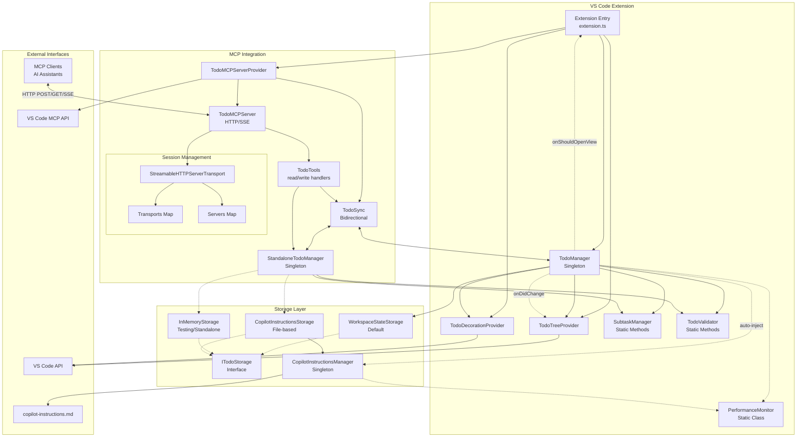

This is a VS Code extension project. Please use the get_vscode_api with a query as input to fetch the latest VS Code API references.

IMPORTANT:

- ALWAYS keep `.github/copilot-instructions.md` up-to-date with the latest architecture and coding standards, addressing any drifts in implementation!
- ALWAYS validate changes by running compile and test commands!
- NEVER proactively create documentation files (\*.md) or README files. Only create documentation files if explicitly requested by the User.
- NEVER make changes backwards compatible unless explicitly requested by the User.
- NEVER create one-off scripts to test changes.

## Project Overview

This extension provides AI assistants with todo management tools through MCP (Model Context Protocol) and an integrated VS Code tree view. It enables AI assistants to proactively track tasks during development workflows with support for subtasks, priorities, and auto-injection into Copilot instructions.

For more details:

- [Main README](../README.md) - Feature overview and usage
- [MCP Server Documentation](../src/mcp/README.md) - Server architecture and protocol details
- [VS Code Extension API](https://code.visualstudio.com/api/extension-guides/tools) - Language model tools guide

## Architecture



## Performance Optimizations

### Event System Architecture

The extension uses a **consolidated event pattern** to prevent performance issues:

```typescript
// CORRECT: Single consolidated event
todoManager.onDidChange((change) => {
  // Handle both todo and title changes
  updateTreeView(change.todos);
  updateTitle(change.title);
});

// WRONG: Never use separate events (causes cascade loops)
// todoManager.onDidChangeTodos(...) // DO NOT USE
// todoManager.onDidChangeTitle(...) // DO NOT USE
```

**Key Requirements:**

- Always use the single `onDidChange` event that provides both todos and title
- Never create or use separate events for different properties
- All managers (TodoManager, StandaloneTodoManager) must implement the same event interface

### Change Deduplication

All state changes use hash-based deduplication to prevent redundant updates:

```typescript
private fireConsolidatedChange(): void {
  const currentHash = JSON.stringify({ todos: this.todos, title: this.title });
  if (currentHash !== this.lastUpdateHash) {
    this.lastUpdateHash = currentHash;
    this.onDidChangeEmitter.fire({ todos: this.todos, title: this.getTitle() });
  }
}
```

### Debouncing Strategy

Different components use specific debounce timings:

- **Tree View Updates**: 150ms debounce for UI responsiveness
- **File Operations**: 500ms debounce to batch rapid changes
- **MCP Sync**: Immediate sync to maintain consistency

### Async Initialization

MCP server initialization is non-blocking to prevent extension startup delays:

```typescript
// Initialize MCP server asynchronously
setImmediate(async () => {
  await mcpProvider.ensureServerStarted();
});
```

### File Operation Queueing

File writes are queued to prevent concurrent access issues:

```typescript
private async writeWithQueue(todos: TodoItem[], title?: string): Promise<void> {
  if (this.writeInProgress) {
    this.pendingWrite = { todos, title };
    return;
  }

  this.writeInProgress = true;
  try {
    await this.performWrite(todos, title);

    // Process any pending write
    if (this.pendingWrite) {
      const pending = this.pendingWrite;
      this.pendingWrite = null;
      await this.writeWithQueue(pending.todos, pending.title);
    }
  } finally {
    this.writeInProgress = false;
  }
}
```

## Coding Standards

### TypeScript Patterns

- Use strict TypeScript with proper type definitions
- Implement singleton pattern for `TodoManager` (see `src/todoManager.ts`)
- Follow VS Code extension conventions with proper disposable cleanup
- Use consolidated event pattern for state management (never separate events)

### VS Code API Usage

- Use `vscode.lm.registerMcpServerDefinitionProvider()` for MCP server integration
- Implement `vscode.TreeDataProvider<T>` for tree views
- Register `vscode.FileDecorationProvider` for todo item styling
- Use `vscode.ThemeIcon` for consistent iconography
- Handle tree view badges with `TreeView.badge` for task counts

### File Organization

```
src/
├── extension.ts                # Main activation/deactivation
├── todoManager.ts              # Singleton state management
├── todoTreeProvider.ts         # Tree view implementation
├── subtaskManager.ts           # Subtask handling
├── copilotInstructionsManager.ts # Auto-inject sync
├── todoValidator.ts            # Input validation
├── types.ts                    # Shared interfaces
├── storage/
│   ├── ITodoStorage.ts         # Storage interface
│   ├── WorkspaceStateStorage.ts # Default VS Code storage
│   ├── InMemoryStorage.ts      # Memory-based storage
│   └── CopilotInstructionsStorage.ts # File-based storage
├── utils/
│   └── performance.ts          # Performance monitoring utility
└── mcp/
    ├── mcpProvider.ts          # VS Code MCP integration
    ├── server.ts               # HTTP/SSE server
    ├── standalone.ts           # Standalone entry point
    ├── standaloneTodoManager.ts # Standalone manager singleton
    ├── todoSync.ts             # Bidirectional sync
    ├── types.ts                # MCP-specific types
    └── tools/
        └── todoTools.ts        # MCP tool implementations
```

## Required Patterns

### Storage Pattern

All storage implementations follow [`ITodoStorage`](../src/storage/ITodoStorage.ts) interface:

```typescript
// Example usage with any storage implementation
const storage: ITodoStorage = new WorkspaceStateStorage(context);
await storage.save(todos, title);
const { todos, title } = await storage.load();
```

Available implementations:

- [`WorkspaceStateStorage`](../src/storage/WorkspaceStateStorage.ts) - VS Code workspace state
- [`InMemoryStorage`](../src/storage/InMemoryStorage.ts) - Temporary in-memory storage
- [`CopilotInstructionsStorage`](../src/storage/CopilotInstructionsStorage.ts) - File-based storage

### MCP Server Provider

```typescript
// Register MCP server provider (not individual tools)
const mcpProvider = new TodoMCPServerProvider(context);
const mcpDisposable = vscode.lm.registerMcpServerDefinitionProvider(
  'todos-mcp-provider',
  mcpProvider
);
context.subscriptions.push(mcpDisposable);

// MCP server handles tool registration internally
export class TodoMCPServerProvider implements vscode.McpServerDefinitionProvider {
  async provideServerDefinition(): Promise<McpServerDefinition> {
    return {
      command: 'node',
      args: [serverPath, `--workspace-root=${workspaceRoot}`],
      transport: { type: 'stdio' as const }
    };
  }
}
```

### Tree View Pattern

```typescript
// Always implement both TreeDataProvider and TreeItem
export class TodoTreeDataProvider
  implements vscode.TreeDataProvider<TodoTreeItem>
{
  private _onDidChangeTreeData = new vscode.EventEmitter<
    TodoTreeItem | undefined | null | void
  >();
  readonly onDidChangeTreeData = this._onDidChangeTreeData.event;

  getTreeItem(element: TodoTreeItem): vscode.TreeItem {
    return element;
  }
  getChildren(element?: TodoTreeItem): Thenable<TodoTreeItem[]> {
    /* implementation */
  }
}
```

### Package.json Contributions

See [`package.json`](../package.json) for full configuration:

- **MCP Server Definition Providers**: Register with `mcpServerDefinitionProviders`
- **Views**: Specify in `explorer` container with `id`, `name`, `icon`
- **Commands**: Define with `command`, `title`, `icon` fields
- **Configuration**: Settings under `todoManager.*` namespace

## Data Models

See [`src/types.ts`](../src/types.ts) for complete type definitions:

- `TodoItem` - Main todo structure with status, priority, subtasks, and details
- `Subtask` - Nested task structure
- `TodoWriteInput` - Input schema for todo_write tool

## Error Handling

- Validate all language model tool inputs before processing
- Return descriptive error messages via `LanguageModelTextPart`
- Use try/catch blocks around VS Code API calls
- Dispose of resources properly in `deactivate()`

## Security Notes

- Never store sensitive data in todo items
- Validate input schemas strictly in language model tools
- Use VS Code's built-in confirmation dialogs for destructive actions

## Testing Strategy

- Test extension activation/deactivation lifecycle
- Verify MCP server and tool operations
- Test tree view data updates and refresh behavior
- Validate todo state persistence across sessions
- Storage implementation compliance with ITodoStorage
- End-to-end MCP integration tests

See test files in [`src/test/`](../src/test/) for examples.
